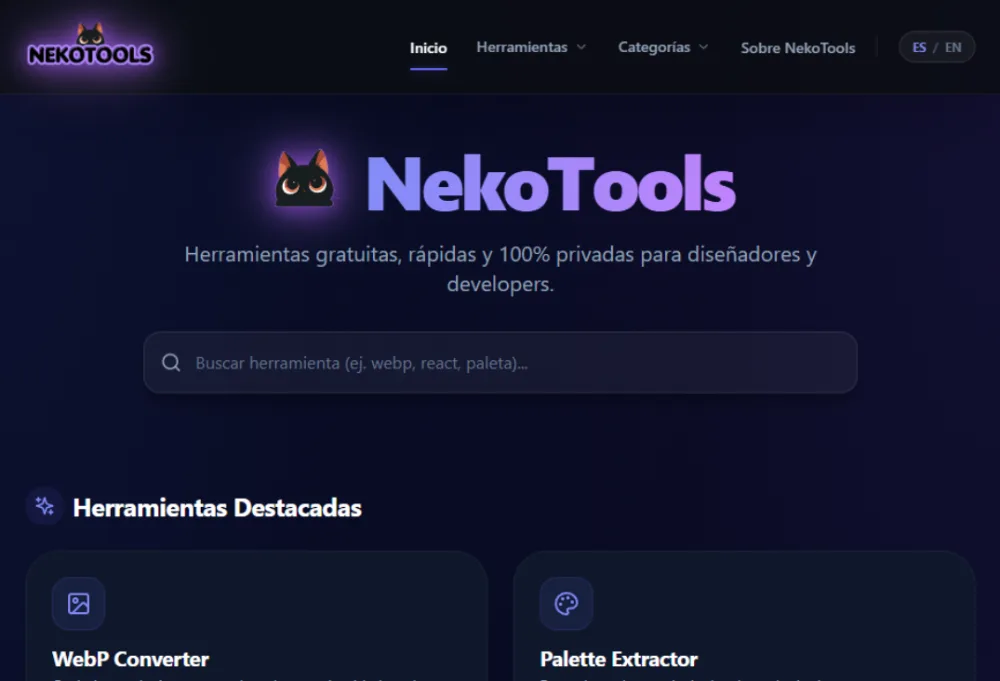

# 🐈 NekoTools

<div align="center">


**Privacy-first creative & developer tools built by CinloDev.**

<br>

[](https://vite.dev)
[](https://react.dev)
[](https://www.typescriptlang.org)

</div>

---
---

## 🌐 Live Demo

**https://tools.cinlodev.com**

---

# ✨ About

NekoTools is a growing collection of modern web utilities designed for developers, designers and digital creators.

Every tool follows the same philosophy:

* ⚡ Fast
* 🔒 Privacy First
* 💻 100% Client-Side whenever possible
* 🎨 Clean and premium UI
* 🚫 No accounts
* 🚫 No ads
* 🚫 No tracking

Whenever feasible, files never leave your computer. Everything runs directly inside your browser.

---

# 🛠 Available Tools

| Tool                             | Status | Guide |
| -------------------------------- | :----: | :---: |
| [🖼️ WebP Converter](./docs/tools/WebPConverter.md)               |    ✅   | [📖 Guía](./docs/tools/WebPConverter.md) |
| [📏 Image Resizer](./docs/tools/ImageResizer.md)                   |    ✅   | [📖 Guía](./docs/tools/ImageResizer.md) |
| [🎨 Palette Extractor](./docs/tools/PaletteExtractor.md)           |    ✅   | [📖 Guía](./docs/tools/PaletteExtractor.md) |
| 🔗 Image to Base64               |    ✅   | - |
| [✒️ Image to SVG Converter](./docs/tools/ImageToSvg.md)         |    ✅   | [📖 Guía](./docs/tools/ImageToSvg.md) |
| ✒️ Image to SVG Converter        |    ✅   | - |
| 🧩 Placeholder Generator         |   🚧   | - |
| ✂️ Background Remover (Local AI) |   🚧   | - |

---

<p align="center">
  
</p>

---

# 🚀 Why NekoTools?

Unlike many online utilities, NekoTools prioritizes privacy and performance.

## Privacy First

Most tools process files directly in your browser.

Your files are **never uploaded** unless a future feature explicitly requires cloud processing.

## Engineering Focused

Built with modern frontend architecture:

* Feature-driven architecture
* Reusable design system
* Web Workers
* Runtime abstractions
* Modular features
* Shared infrastructure

## Premium Experience

Every tool shares:

* Responsive interface
* Dark mode
* Consistent UX
* Smooth animations
* Fast interactions

---

# 🧰 Technology Stack

* React
* Vite
* TypeScript
* Tailwind CSS v4
* Framer Motion
* Lucide Icons
* Canvas API
* Web Workers

---

# 📚 Documentation

Project documentation can be found inside the **docs** directory.

* 📦 [Product](./docs/PRODUCT.md)
* 🎯 [Vision](./docs/VISION.md)
* 🧠 [Philosophy](./docs/PHILOSOPHY.md)
* 🏗️ [Architecture](./docs/ARCHITECTURE.md)
* ✨ [Features](./docs/FEATURES.md)
* 🎨 [Design System](./docs/DESIGN_SYSTEM.md)
* 🚀 [Roadmap](./docs/ROADMAP.md)
* 🔍 [SEO](./docs/SEO.md)
* 🎭 [Brand](./docs/BRAND.md)
* 🤝 [Contributing](./docs/CONTRIBUTING.md)

---

# 🚀 Getting Started

Clone the repository:

```bash
git clone https://github.com/CinloDev/neko-tools.git
```

Install dependencies:

```bash
pnpm install
```

Run the development server:

```bash
pnpm dev
```

Create a production build:

```bash
pnpm build
```

---

# 🗺️ Roadmap

Current priorities:

* 🧩 Placeholder Generator
* ✂️ Background Remover (Browser AI)
* 🎭 Favicon Generator
* 🖼️ Open Graph Image Generator
* 📝 JSON Formatter
* 🔐 JWT Decoder
* 🧪 Regex Tester
* 🎨 CSS Gradient Generator

See the complete roadmap in:

**docs/ROADMAP.md**

---

# 🌐 CinloDev Ecosystem

NekoTools is part of the CinloDev ecosystem.

Current projects include:

* 🌍 Portfolio
* 🦷 CinloLabs
* 💰 AlDía
* 📦 Command Vault
* 🐈 NekoTools

---

# 👩‍💻 Author

**Cintia Losada**

Frontend Developer focused on building high-quality SaaS products, developer tools and modern user experiences.

* 🌐 https://portfolio.cinlodev.com
* 💼 https://linkedin.com/in/cinlodev

---

# 📄 License

This project is licensed under the MIT License.

---

<p align="center">

Made with ❤️ by <strong>CinloDev</strong>

</p>
