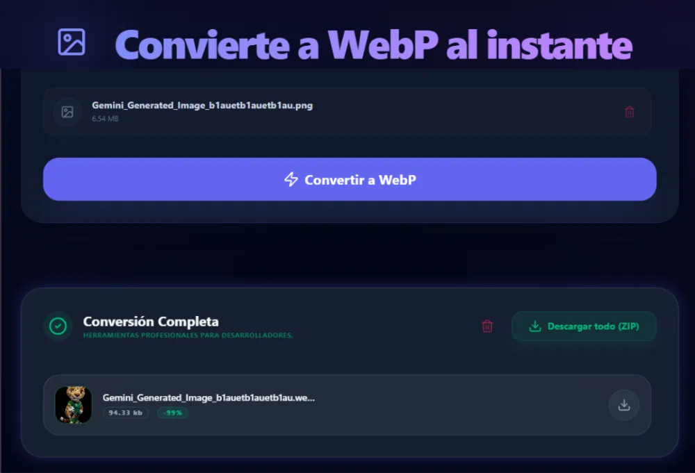
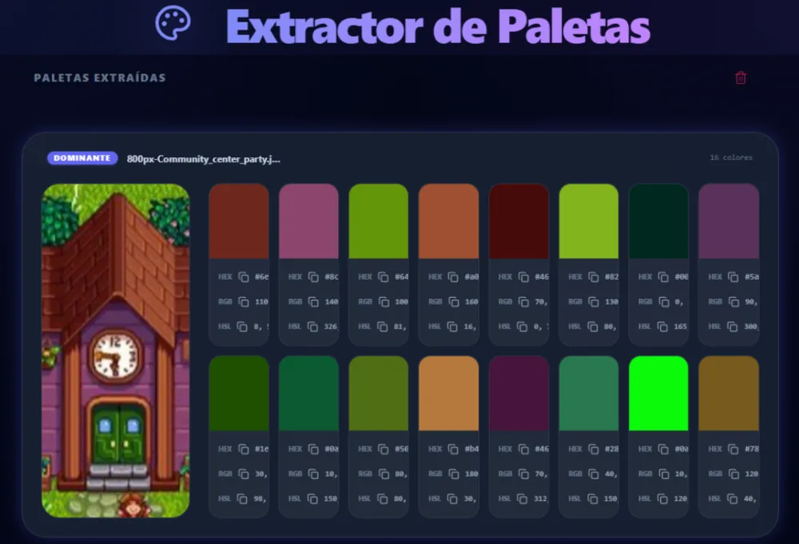
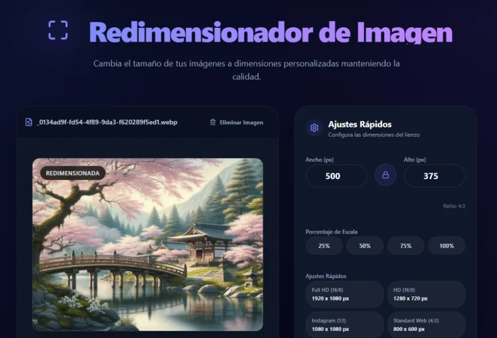
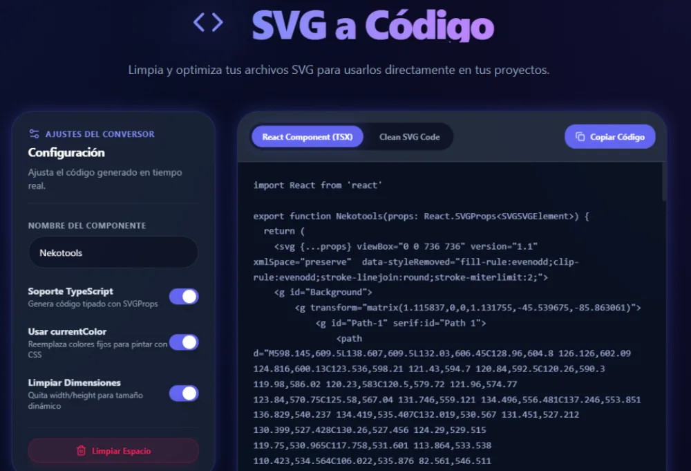

# 🐈 NekoTools - Características

  <strong>Herramientas para desarrolladores y creativos, rápidas, privadas y modernas.</strong>

 

---

NekoTools está diseñado como un ecosistema de herramientas web enfocadas en desarrolladores, diseñadores y creadores de contenido. Todas las herramientas comparten una misma filosofía: **privacidad, rendimiento y una experiencia de usuario premium**.

---

# 🎯 Principios de la Plataforma

## 🔒 Privacidad por Diseño

Toda la información se procesa directamente en el navegador.

- Sin subida de archivos a servidores.
- Sin almacenamiento remoto.
- Sin seguimiento de usuarios.
- Sin necesidad de crear una cuenta.

La mayoría de las herramientas funcionan completamente **Client-Side**, aprovechando las APIs modernas del navegador.

---

## ⚡ Alto Rendimiento

NekoTools fue construido para sentirse como una aplicación de escritorio.

Características principales:

- Procesamiento mediante Web Workers.
- Operaciones pesadas fuera del hilo principal.
- Interfaz siempre fluida.
- Procesamiento en paralelo cuando es posible.
- Limpieza automática de memoria.

---

## 🎨 Diseño Consistente

Todas las herramientas utilizan el mismo Design System.

- Componentes reutilizables.
- Tema oscuro premium.
- Tokens semánticos.
- Responsive.
- Animaciones suaves.
- Accesibilidad.

Esto permite que cualquier nueva herramienta mantenga automáticamente la identidad visual de la plataforma.

---

# 🧰 Herramientas Disponibles

## 🖼️ WebP Converter

Convierte imágenes a formato WebP de forma local.

Características:

- Conversión múltiple.
- Control de calidad.
- Descarga individual o por lote.
- Vista previa.
- Sin pérdida innecesaria de calidad.

Estado:

**Disponible**

  

---

## 🎨 Palette Extractor

Extrae automáticamente los colores predominantes de una imagen.

Características:

- Colores dominantes.
- Código HEX.
- Copiado rápido.
- Vista previa.
- Procesamiento local.

Estado:

**Disponible**

  

---

## 📏 Image Resizer

Permite cambiar el tamaño de imágenes antes de exportarlas.

Características:

- Mantener proporción.
- Redimensionado por píxeles.
- Presets comunes.
- Exportación optimizada.

Estado:

**Disponible**

  

---

## 🔗 Image to Base64

Convierte imágenes a distintos formatos Base64.

Incluye:

- Base64 puro.
- Data URI.
- HTML.
- CSS.
- JSX para React.

Estado:

**Disponible**

---

## 📐 SVG to React

Convierte archivos SVG en componentes React listos para usar.

Características:

- Limpieza automática.
- currentColor.
- JSX.
- TypeScript.
- Optimización del SVG.

Estado:

**Disponible**

  

---

# 🚧 Próximas Herramientas

## 🧩 Placeholder Generator

Generador de imágenes temporales para maquetación.

Funciones previstas:

- Tamaños personalizados.
- Colores.
- Texto.
- Exportación PNG.

Estado:

**En desarrollo**

---

## ✂️ Remove Background

Eliminación automática de fondos mediante IA ejecutándose completamente en el navegador.

Características previstas:

- IA local.
- Sin subir imágenes.
- Exportación PNG.
- Alta calidad.

Estado:

**Planificado**

---

## 🎭 Favicon Generator

Generación completa de iconos para aplicaciones web.

Incluirá:

- favicon.ico
- Apple Touch Icon
- Android Icons
- Manifest
- Social Images

Estado:

**Planificado**

---

## 🧼 SVG Cleaner

Optimización avanzada de SVG.

Funciones:

- Eliminar metadatos.
- Minificar.
- Optimizar atributos.
- Compatibilidad con React.

Estado:

**Planificado**

---

## 📝 Markdown Preview

Editor Markdown con vista previa en tiempo real.

Estado:

**Planificado**

---

## 🔐 JWT Decoder

Visualización y análisis de tokens JWT.

Estado:

**Planificado**

---

## 🌈 CSS & Frontend Utilities

Conjunto de herramientas para desarrollo Frontend.

Planificadas:

- CSS Gradient Generator
- Box Shadow Generator
- Tailwind Playground
- Open Graph Preview
- Regex Tester
- JSON Formatter

---

# 🧠 Arquitectura Compartida

Todas las herramientas utilizan la misma infraestructura.

Incluye:

- Design System compartido.
- Layout unificado.
- Componentes reutilizables.
- Hooks reutilizables.
- Web Workers.
- Sistema de Jobs.
- Runtime compartido.
- Lazy Loading.

Esto permite mantener una experiencia consistente y facilita la incorporación de nuevas herramientas.

---

# 🚀 Objetivo del Proyecto

NekoTools no busca ser únicamente un conjunto de utilidades aisladas.

El objetivo es construir un **ecosistema de herramientas profesionales**, donde cada nueva funcionalidad reutilice la infraestructura existente y mantenga los mismos estándares de rendimiento, privacidad y experiencia de usuario.

Cada herramienta debe cumplir con tres principios fundamentales:

- Resolver un problema real.
- Ejecutarse con el máximo rendimiento posible.
- Mantener la privacidad del usuario como prioridad.