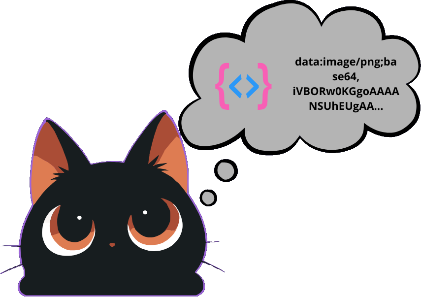

# 🖼️ Image to Base64 Generator — Guía Oficial de Uso

**Convierte imágenes al instante en cadenas Base64, Data URIs o fragmentos listos para HTML y CSS — 100% local en tu navegador.**

---

## ⚡ ¿Qué hace Image to Base64 Generator?

**Image to Base64 Generator** convierte archivos gráficos (`PNG`, `JPG`, `WebP`, `SVG`, `GIF`) en cadenas codificadas en **Base64** instantáneamente. Es la herramienta ideal para incrustar iconos, logotipos o imágenes pequeñas directamente dentro de tu código HTML, CSS o JSON sin realizar peticiones HTTP adicionales.

Todo el proceso de conversión ocurre en memoria dentro de tu navegador utilizando APIs nativas (`FileReader.readAsDataURL`), garantizando máxima velocidad y **privacidad absoluta**.

---

## ✨ Características Principales

* **📦 Múltiples Formatos de Exportación:**
  * **Data URI (`dataURI`):** `data:image/png;base64,iVBORw0KGgo...` (estándar para incrustar en src o backgrounds).
  * **Etiqueta HTML (`html`):** `` (listo para copiar y pegar en tu DOM).
  * **CSS Background (`css`):** `background-image: url('data:image/png;base64,...');` (listo para hojas de estilo).
  * **Cadena Raw (`raw`):** Solo el texto codificado en Base64 puro sin prefijos.
* **🛡️ Protección de Rendimiento DOM (`Smart Truncation`):**
  * Las cadenas Base64 largas pueden congelar el navegador si se renderizan completas en el DOM. La herramienta muestra una vista previa segura del código (truncada inteligentemente en 800 caracteres) mientras el botón **Copiar** coloca el 100% del código completo en tu portapapeles.
* **📊 Comparador de Peso Real:**
  * Muestra el peso original del archivo en KB/MB junto al tamaño resultante codificado en Base64.
  * Alerta automática cuando el archivo codificado aumenta el tamaño en más de un 30% (comportamiento inherente de Base64), ayudándote a decidir cuándo conviene incrustar o enlazar el archivo.
* **📋 Copiado Inteligente en 1 Clic:**
  * Copia el fragmento en tu portapapeles con confirmación visual al instante.

---

## 🛠️ Cómo Usar Image to Base64 Generator (Paso a Paso)

### 1. Selecciona o Arrastra tu Imagen
* Sube cualquier archivo gráfico desde tu ordenador.
* Al instante se procesará y se generará su código Base64.

---

### 2. Elige el Formato de Salida
En las pestañas superiores del panel de código, selecciona cómo quieres utilizarlo:
1. **Data URI:** Si necesitas el formato estándar con cabecera MIME.
2. **HTML:** Para obtener la etiqueta `` completa.
3. **CSS:** Para pegarlo en reglas CSS `background-image`.
4. **Raw:** Si lo necesitas para APIs, JSON o bases de datos.

---

### 3. Copia al Portapapeles
* Haz clic en **Copiar Código**. El 100% del código Base64 se copiará en tu portapapeles listo para usar en tu proyecto.

---

## 🔒 Privacidad y Seguridad Client-Side

1. **Cero Peticiones de Subida:** Tu archivo no sale de tu ordenador ni se sube a ningún servidor web.
2. **Protección Anti-Congelamiento:** La interfaz está protegida contra colapsos al manejar imágenes pesadas gracias al renderizado truncado seguro.
