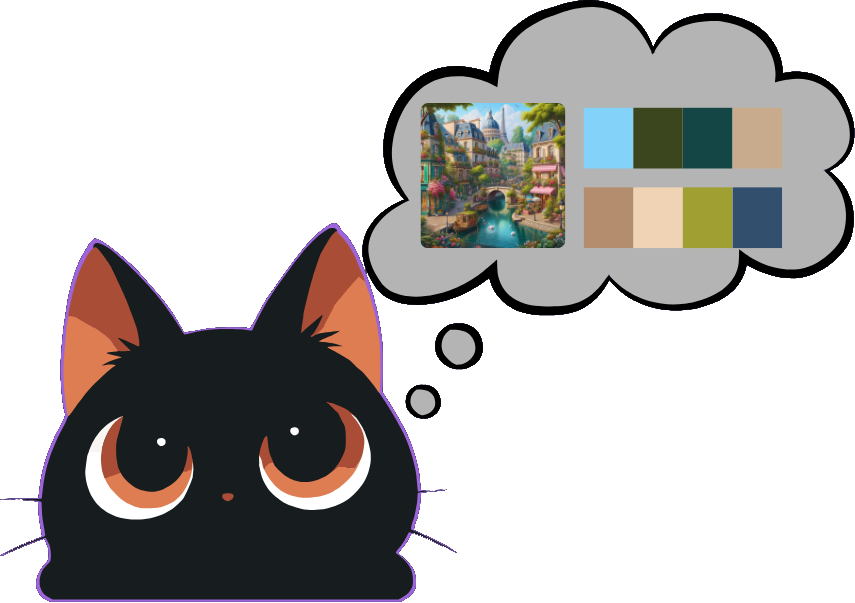

# 🎨 Palette Extractor — Guía Oficial de Uso

**Extrae paletas de colores armónicas, colores dominantes y códigos exactos (HEX, RGB, HSL) a partir de tus imágenes — 100% local en tu navegador.**

---

## ⚡ ¿Qué hace Palette Extractor?

**Palette Extractor** es una herramienta de análisis cromático diseñada para diseñadores de interfaz, ilustradores, desarrolladores front-end y creadores de contenido. Permite extraer al instante la paleta de colores dominante y secundaria de cualquier imagen (`PNG`, `JPG`, `WebP`).

A diferencia de extractores en línea que suben tus imágenes a servidores externos, **Palette Extractor** procesa los píxeles directamente en tu dispositivo utilizando un **Web Worker dedicado** (`palette.worker.ts`), analizando canales de color sin congelar la interfaz ni arriesgar tu privacidad.

---

## ✨ Características Principales

* **🎨 Selección de Tamaño de Paleta (`8` o `16` colores):**
  * **8 Colores:** Extrae los tonos esenciales y más distintivos para crear temas visuales concisos o UI kits rápidos.
  * **16 Colores:** Análisis cromático detallado ideal para fotografías ricas, ilustraciones artísticas o degradados complejos.
* **🔬 Modo de Profundidad de Análisis (`Deep Analysis`):**
  * Opción para realizar un escaneo de cuantificación exhaustivo de mayor precisión sobre la imagen.
* **📋 Copiado Instantáneo Multiformato:**
  * Con un solo clic puedes copiar cada color en los formatos estándar web y de diseño:
    * **HEX:** `#143250`
    * **RGB:** `rgb(20, 50, 80)`
    * **HSL:** `hsl(210, 60%, 20%)`
  * Retroalimentación visual inmediata con confirmación verde (`¡copiado!`) sin desalinear la interfaz.
* **🏷️ Detección de Color Dominante:**
  * Identifica automáticamente el color preponderante del archivo y lo destaca mediante una insignia en cada tarjeta de resultado.
* **⚡ Cola Múltiple Segura y Reinicio de Ciclo:**
  * Soporta carga y cola de análisis protegida contra sobrecarga de memoria (límite máximo de seguridad de `10 imágenes` en cola por lote).
  * Botón **Analizar otra imagen** para reiniciar limpiamente el ciclo y probar con nuevas configuraciones.

---

## 🛠️ Cómo Usar Palette Extractor (Paso a Paso)

### 1. Sube tu Imagen o Conjunto de Imágenes
* Arrastra una o varias imágenes a la zona de subida interactiva o selecciónalas con el explorador de archivos.
* Verás tus archivos listados en la cola de procesamiento listos para ser analizados.

---

### 2. Configura los Parámetros de Extracción
Antes de extraer, ajusta las opciones en la barra de configuración superior:
1. **Elige la Cantidad de Colores:** Selecciona `8 colores` o `16 colores`.
2. **Profundidad de Análisis:** Activa o desactiva la opción para un muestreo rápido o exhaustivo.

---

### 3. Extrae las Paletas y Copia los Colores
* Haz clic en el botón **Extraer Paletas**.
* En milisegundos aparecerán las tarjetas de resultado apiladas, mostrando una previsualización de tu imagen original junto a su grilla de colores perfectamente alineada (`4 columnas` en pantallas medianas y grandes para simetría perfecta).
* Haz clic en cualquier botón **HEX**, **RGB** o **HSL** para copiar el código directamente al portapapeles y pegarlo en tu editor de código, CSS o Figma.

---

## 🔒 Privacidad y Arquitectura Client-Side

1. **Cero Transferencia de Datos:** El archivo original nunca se transmite por internet.
2. **Procesamiento Asíncrono en Web Worker:** Todo el muestreo de cuantificación de color se ejecuta de forma concurrente fuera del hilo principal de la página, garantizando una experiencia fluida.
