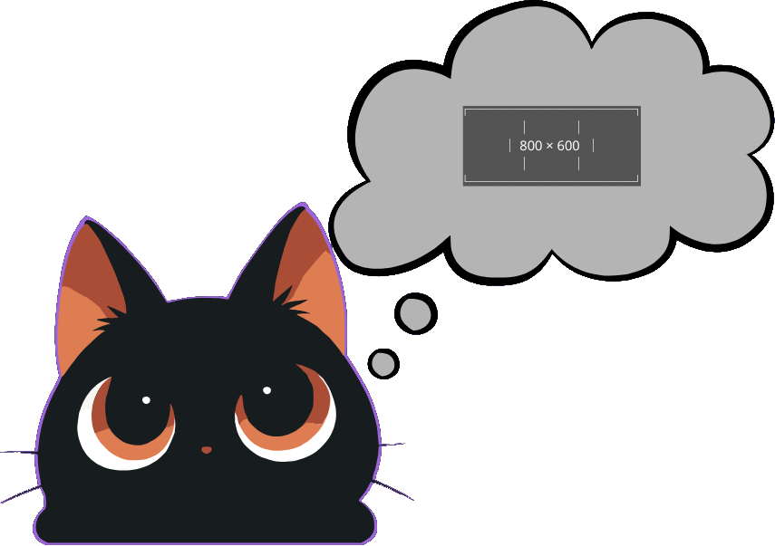

# 🧩 Placeholder Generator — Guía Oficial de Uso y Arquitectura

<div align="center">



**Generador instantáneo de imágenes de relleno (placeholders y mockups visuales) con exportación vectorial SVG, PNG y JPG — 100% local en tu navegador.**

[](https://tools.cinlodev.com/placeholder)
[](https://tools.cinlodev.com/placeholder)

</div>

---

## ⚡ ¿Qué hace Placeholder Generator?

**Placeholder Generator** es una herramienta de maquetación visual y prototipado diseñada para crear imágenes de relleno profesionales con dimensiones personalizadas, tipografías escalables y fondos avanzados sin necesidad de software de diseño externo ni peticiones al servidor.

Construida sobre el núcleo arquitectónico **`src/shared/lib/graphics`** de NekoTools, la herramienta procesa escenas visuales estructuradas (`ImageDocument`) y las renderiza en tiempo real en el navegador mediante `HTML5 Canvas`, garantizando que todas tus creaciones permanezcan totalmente privadas en tu dispositivo.

---

## ✨ Características Principales

* **🎨 4 Modos de Fondo Profesionales:**
  * **Sólido (`Solid`):** Colores sólidos personalizados mediante selector visual HEX/RGBA.
  * **Gradiente Lineal (`Linear`):** Transición cromática suave entre dos colores con **8 botones rápidos de dirección** (`⬆ 0°`, `↗ 45°`, `➡ 90°`, `↘ 135°`, `⬇ 180°`, `↙ 225°`, `⬅ 270°`, `↖ 315°`) y deslizador de precisión (0°–360°).
  * **Gradiente Radial (`Radial`):** Difuminado circular centrado con radio de alto impacto visual.
  * **Fondo 100% Transparente (`Transparent`):** Lienzo transparente ideal para exportar logotipos, maquetación sobre fondos dinámicos o archivos PNG/SVG sin fondo.

* **📝 Capa de Texto Multilínea Adaptativa:**
  * **Dimensiones Automáticas:** Muestra de forma dinámica la resolución actual (`Ej. 1200 × 630px`).
  * **Texto Personalizado Multilínea:** Soporte nativo para saltos de línea (`\n`), calculando automáticamente el tamaño óptimo de fuente basándose en la línea más larga y el número de renglones (`calculateAutoFontSize`).
  * **Alineación y Color:** Centrado vertical y horizontal perfecto con selector de color independiente.

* **📐 Catálogo Completo de Presets Rápidos:**
  * **Redes Sociales & Banners:** Open Graph (`1200×630`), Twitter Card (`1200×675`), Facebook Cover (`820×312`), X/Twitter Header (`1500×500`), LinkedIn Cover (`1584×396`), YouTube Thumbnail (`1280×720`), Discord Banner (`1200×480`), Twitch Banner (`1200×480`).
  * **Comunidades Creativas & Tiendas:** Dribbble Shot (`1600×1200`), Behance Cover (`1400×1000`), Product Hunt Gallery (`1270×760`), Steam Capsule (`460×215`).
  * **UI / Web Componentes:** Hero Banner (`1200×400`), Standard Banner (`728×90`), Avatar (`400×400`), Favicon (`512×512`).

* **🔲 Bordes Redondeados Inteligentes (`Border Radius`):**
  * Aplicación de recorte suave sobre el lienzo en tiempo real y en el archivo exportado: `0px` (cuadrado), `8px`, `16px`, `24px` o `Píldora` (redondeado circular completo).

* **🚀 Exportación Multi-Formato Instantánea:**
  * **Descarga PNG:** Imagen ráster sin compresión, respetando la transparencia si el fondo está en modo transparente.
  * **Descarga JPG:** Exportación ráster de alta calidad (0.92) para peso optimizado.
  * **Descarga SVG Vectorial Puro:** Genera un archivo XML/SVG semántico con etiquetas nativas `<linearGradient>` y `<radialGradient>`, textos escalables y sin dependencias externas.
  * **Copiar Imagen:** Copia la imagen PNG renderizada directamente al portapapeles del sistema operativo para pegar en Figma, Slack o editores de texto.

---

## 🏛️ Arquitectura y Componentes del Módulo

La herramienta está organizada de forma autocontenida bajo la arquitectura Feature-Based de NekoTools:

```text
src/features/placeholder-generator/
├── ui/
│   ├── CanvasPreview.tsx               # Lienzo interactivo en tiempo real integrado con CanvasRenderer
│   ├── SizeSelector.tsx                # Entradas de anchura/altura y grilla con scrollbar oscuro de presets
│   ├── BackgroundEditor.tsx            # Pestañas Sólido/Lineal/Radial/Transparente + flechas de dirección
│   ├── TextLayerEditor.tsx             # Área multilínea para texto personalizado y selector de color
│   ├── RadiusSelector.tsx              # Selector de radio de esquinas
│   ├── ImageExporter.tsx               # Botones de exportación PNG, JPG, SVG y Portapapeles
│   └── placeholder-generator-feature.tsx # Orquestador de disposición de página (Canvas izquierdo + Panel derecho)
├── hooks/
│   └── usePlaceholderGenerator.ts      # Estado centralizado de la escena ImageDocument
└── types/
    └── placeholder.types.ts            # Tipado estricto de la herramienta
```

---

## 🛠️ Flujo de Trabajo

1. **Configurar Dimensiones:** Selecciona un preset rápido o ingresa dimensiones personalizadas en píxeles.
2. **Personalizar el Fondo:** Elige el estilo cromático deseado (Sólido, Gradiente Lineal con flecha de dirección, Gradiente Radial o Transparente).
3. **Escribir o Ajustar Texto:** Permite saltos de línea para títulos multilínea o mantén la visualización automática de la resolución.
4. **Definir Bordes:** Ajusta las esquinas según el lenguaje visual de tu interfaz.
5. **Exportar:** Descarga en tu formato preferido (`PNG`, `JPG` o `SVG` editable) o copia al portapapeles con un solo clic.
