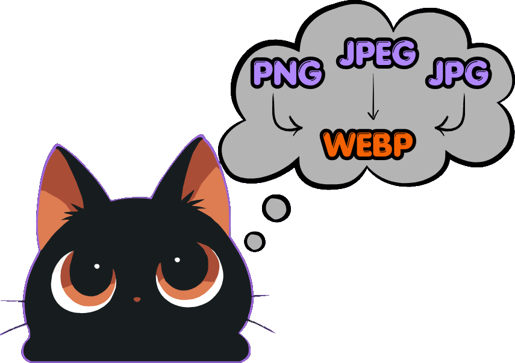

# 🖼️ WebP Converter — Guía Oficial de Uso

<div align="center">



**Convierte imágenes PNG, JPG o JPEG a formato WebP moderno con optimización de calidad y compresión extrema — 100% local en tu navegador.**

[](https://tools.cinlodev.com)
[](https://tools.cinlodev.com)

</div>

---

## ⚡ ¿Qué hace WebP Converter?

**WebP Converter** es una herramienta de conversión de imágenes de ultra alto rendimiento diseñada para desarrolladores, diseñadores web y creadores de contenido. Permite transformar imágenes tradicionales (`.png`, `.jpg`, `.jpeg`) en formato **WebP**, reduciendo drásticamente el peso de los archivos (entre un **30% y 80%** de ahorro de bytes) sin pérdida perceptible de calidad visual.

### ✨ Características Principales
* **🚀 Procesamiento en Lote (Batch Processing):** Convierte decenas de imágenes simultáneamente.
* **🔒 Privacidad Absoluta (Client-Side):** Ninguna imagen se sube a servidores externos ni a la nube. El procesamiento ocurre dentro de Web Workers aislados en tu navegador usando las APIs nativas de decodificación y `OffscreenCanvas`.
* **🎨 Presets Inteligentes:** Tres modos predefinidos optimizados para diferentes escenarios (UI, Web y Alta Calidad).
* **📦 Descarga en ZIP o Individual:** Descarga imágenes de una en una o todas empaquetadas en un único archivo `.zip`.
* **➕ Añadido Dinámico:** Carga imágenes adicionales a la cola sin perder el progreso ni la configuración actual.

---

## 🛠️ Cómo Usar WebP Converter (Paso a Paso)

### 1. Elige un Preset de Calidad
Antes o después de subir tus archivos, selecciona el ajuste que mejor se adapte al uso que darás a las imágenes:

| Preset | Calidad | Uso Recomendado |
| :--- | :---: | :--- |
| **UI Optimized** | **80%** | Iconos, logotipos, botones e interfaces de aplicaciones móviles o web. |
| **Web Standard** | **85%** | Fotografías de productos, artículos de blog e imágenes generales para páginas web. |
| **High Quality** | **92%** | Banners hero, portadas o imágenes donde la máxima fidelidad visual sea indispensable. |

---

### 2. Sube o Arrastra tus Imágenes
* En el área principal (**Dropzone**), arrastra uno o varios archivos `.png`, `.jpg` o `.jpeg`.
* O haz clic en **"Browse Files"** para seleccionarlos desde tu sistema.
* **Soporte continuo:** Una vez cargadas las primeras imágenes, verás una barra superior compacta (**"+ Agregar más"**) donde podrás arrastrar más archivos para sumarlos a la cola al instante.

---

### 3. Inicia la Conversión
* Haz clic en el botón principal **"Convert to WebP"**.
* El motor utilizará hilos en paralelo (Web Workers) para procesar las imágenes a máxima velocidad sin congelar la interfaz visual.

---

### 4. Revisa los Resultados y Descarga
Al finalizar, aparecerá el panel de resultados mostrando:
* El peso original comparado con el peso convertido en WebP.
* El porcentaje exacto de ahorro (`Savings`).
* Opciones de descarga:
  * **Descarga Individual:** Haz clic en el botón de descarga en cada tarjeta de imagen.
  * **Descarga Completa (ZIP):** Haz clic en **"Download All (ZIP)"** para exportar todas las conversiones en un solo paquete comprimido.

---

## 🔬 Detalles Técnicos y Arquitectura

```text
[Archivos Locales] 
       │
       ▼ (Drag & Drop / Input)
[Web Worker Pool (OffscreenCanvas)] ──► [Compresión WebP nativa]
       │
       ▼
[Object URLs / ZIP Generator (JSZip)] ──► [Descarga Inmediata]
```

* **Gestión Eficiente de Memoria:** Los object URLs y buffers de imagen se gestionan mediante el `WorkerRuntime` de NekoTools, liberando automáticamente la memoria en cuanto finaliza o se limpia la cola.
* **Sin Límites Artificiales:** El tamaño máximo por archivo depende únicamente de la memoria RAM disponible en tu dispositivo.

---

<div align="center">

**[← Visitar a NekoTools](https://tools.cinlodev.com)**

</div>
