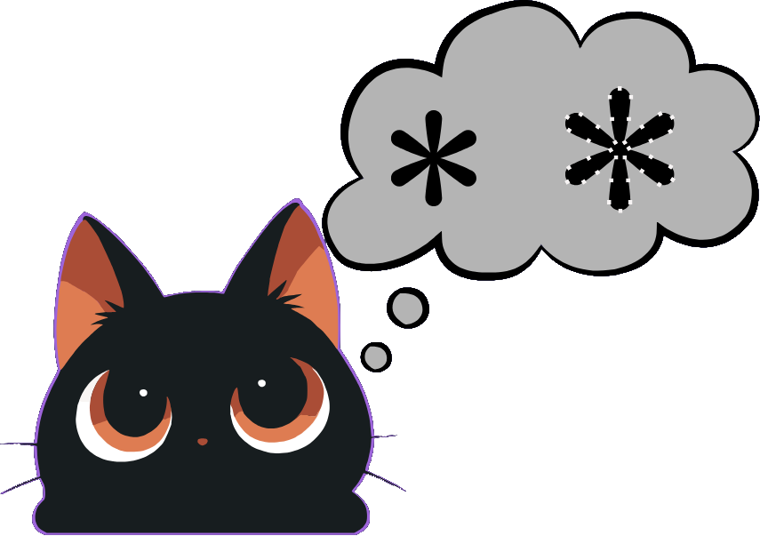

# 📐 Image to SVG Converter — Guía Oficial de Uso

**Vectoriza imágenes de mapa de bits (PNG, JPG, WebP) a gráficos vectoriales SVG limpios, editables y ligeros — 100% local en tu navegador.**

---

## ⚡ ¿Qué hace Image to SVG Converter?

**Image to SVG Converter** es un vectorizador profesional del lado del cliente diseñado para convertir imágenes ráster o de mapa de bits (`PNG`, `JPG`, `WebP`) en vectores gráficos escalables (`.svg`). 

A diferencia de trazadores tradicionales en servidores remotos, **Image to SVG Converter** ejecuta su motor de cuantificación de color, trazado de contornos y simplificación de curvas de Bézier completamente dentro de un **Web Worker dedicado** en tu navegador web. Tus archivos e ilustraciones **nunca salen de tu equipo ni se envían a servidores externos**.

---

## ✨ Características Principales

* **🎨 Presets Inteligentes de Calidad:**
  * **Rápida (`Fast`):** Optimizado para menor cantidad de paths y colores con procesamiento instantáneo.
  * **Balanceada (`Balanced`):** Equilibrio perfecto entre nitidez visual y ligereza del archivo exportado.
  * **Máxima (`Max`):** Precisión superior en esquinas y formas necesarias sin generar ruido visual innecesario.
* **🛡️ Modo de Trazado Especializado:**
  * **Logo:** Prioriza geometría limpia, bordes nítidos y paletas concisas ideal para logotipos o iconos de marca.
  * **Ilustración:** Mantiene transiciones cromáticas orgánicas y mayor riqueza de formas para arte digital o ilustraciones complejas.
* **🎛️ Control de Colores y Suavizado:**
  * Ajuste exacto del número máximo de colores vectorizados (`2`, `4`, `8`, `12` o `16` colores).
  * Niveles configurables de suavizado y reducción de nodos (`Bajo`, `Medio`, `Alto`) para evitar archivos SVG pesados.
* **🛡️ Protección Automática de Memoria (`4096px Safe-Mode`):**
  * Detecta imágenes gigantes y las redimensiona automáticamente de forma transparente antes de vectorizar para evitar saturar la memoria RAM o bloquear el hilo del navegador.
* **🔍 Visor Comparativo Estilo Figma:**
  * Vista dividida en tiempo real (`Dividida` / `Solo Vector`) con controles de zoom (`50%` a `300%`) y fondo con cuadrícula arquitectónica para verificar transparencias.
* **📈 Estadísticas de Vectorización en Vivo:**
  * Muestra al instante número total de `paths`, cantidad de `colores`, tamaño optimizado en `KB` con porcentaje de reducción y compatibilidad certificada con **Adobe Illustrator** y **Affinity Designer**.

---

## 🛠️ Cómo Usar Image to SVG Converter (Paso a Paso)

### 1. Sube tu Imagen o Logotipo
* Arrastra tu imagen (`PNG`, `JPG` o `WebP`) a la zona de carga inicial o haz clic para explorar tus archivos.
* El motor analiza de inmediato las dimensiones del archivo y arranca el primer trazado vectorial automáticamente.

---

### 2. Ajusta los Parámetros de Vectorizado
En el panel de controles inferior puedes personalizar el resultado a tu gusto:
1. **Selecciona el Nivel de Calidad:** Elige entre `Rápida`, `Balanceada` o `Máxima` según la complejidad de tu gráfico.
2. **Elige el Modo de Trazado:** Selecciona `Logo` si buscas trazos geométricos definidos, o `Ilustración` si la imagen tiene múltiples formas.
3. **Cantidad de Colores y Suavizado:** Limita la paleta (ej. `4` colores para un ícono plano) y ajusta el nivel de nodos.
4. **Fondo Transparente:** Activa o desactiva la opción para eliminar automáticamente el fondo plano de la imagen.

---

### 3. Inspecciona en el Visor y Exporta
* Utiliza las pestañas **Dividida** para comparar la imagen original de mapa de bits (izquierda) frente al resultado vectorial (derecha), o cambia a **Solo Vector** para ver el SVG a pantalla completa.
* Haz zoom con los botones `+` / `-` o restaura con el botón de reinicio.
* Haz clic en **Descargar SVG** para guardar un archivo `.svg` 100% editable en tu computadora al instante.

---

## 🔒 Privacidad y Rendimiento Client-Side

1. **Sin Servidores de Terceros:** La conversión de mapa de bits a curvas vectoriales ocurre 100% en el dispositivo del usuario.
2. **Sin Cuellos de Botella en UI:** Todo el cálculo matemático intensivo de trazado se aísla en un **Web Worker** (`vectorizer.worker.ts`), manteniendo la interfaz web fluida en todo momento.
